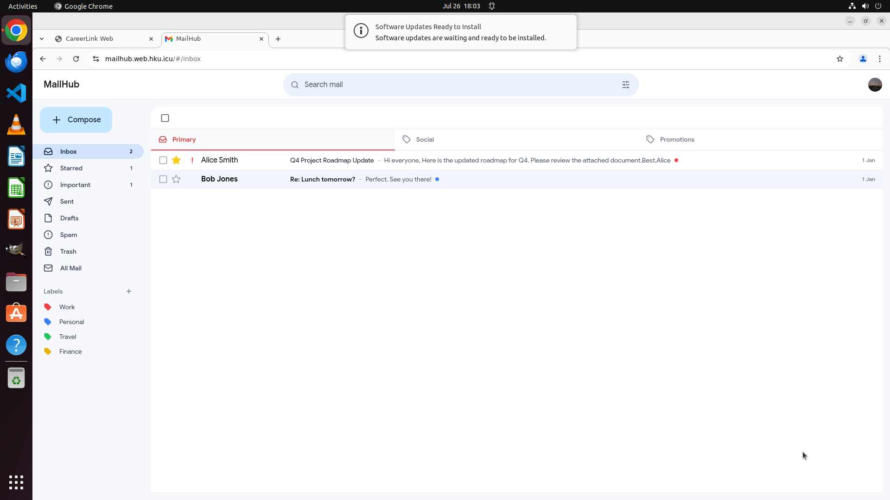
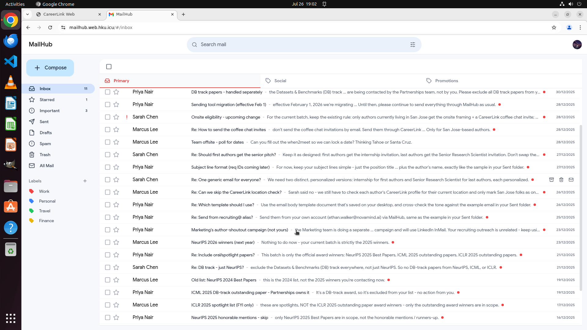

# OSChaff — Making OSWorld 2.0 Progressively Harder

Claude Opus 5 is already scoring around 70% on OSWorld 2.0 — a benchmark that is barely a year old — and people are already asking where the harder benchmark is going to come from. That's a rough deal for the folks who built it: OSWorld 2.0 represents an enormous amount of human effort — 108 long-horizon tasks, each hand-built and hand-validated (the authors checked every grader against real runs), plus an entire fleet of purpose-built web apps for the tasks to live in. You don't just crank out another one of those every time the models level up.

And even if you did — build OSWorld 3, spend another year on it — the models improve again, and you're right back where you started. Benchmark treadmills are expensive.

This project tries a different angle: instead of building a new benchmark, **make the existing tasks progressively harder** with a configurable command-line tool. Keep the tasks, keep the validated graders, and add a difficulty dial you can keep turning as the models keep improving.

I call it [OSChaff](https://github.com/dannnnthemannnn/OSChaff).

> **chaff** (n.) — 1. the husks of grain separated from the seed by threshing. 2. strips of metal foil dropped by aircraft to confuse enemy radar.

## OSWorld — A Seedable OS for Computer-Use Testing

[OSWorld 2.0](https://osworld-v2.xlang.ai/) drops an AI agent into a real Ubuntu desktop — actual Chrome, actual LibreOffice, actual file manager. The agent sees screenshots, moves a mouse, and types. Just like you, but with more confidence and less dread.

The clever part is the app ecosystem. The benchmark authors recreated a suite of everyday web apps — a Gmail clone (MailHub), a Slack clone (TeamChat), a LinkedIn clone (CareerLink), booking sites, and more — specifically so that their **state can be seeded**. Before a run starts, the task pushes a JSON blob to the app's state API: here are the emails in the inbox, here are the chat messages, here's the user's profile. And every run gets its own "cookie" — a fresh user ID — so each agent sees its own isolated copy of the world. Your inbox is a real, live website containing exactly the emails the task authors planted there.

The tasks built on top of this are long, multi-app knowledge work. For example:

- **Vaccine booking** — read the immunization-requirements email, compare it against your vaccination record PDF, and book the missing appointments on the clinic website: cheapest clinic first, within 10km, one shot per day.
- **Recruiting outreach** — find the award-winning papers from three ML conferences, hunt down each paper's first and last authors' emails on the open web, send personalized recruiting emails to each, and check a LinkedIn clone to decide who gets the "onsite" pitch.
- **Purchasing approvals** — read the manager's budget rules in TeamChat, apply them to five purchase requests, and update the purchase-order spreadsheet accordingly.

Each task comes with a hand-validated grader, many with partial credit.

So how can we make it even harder?

## Enter OSChaff

OSChaff is a small command-line tool that takes an OSWorld task and injects **distractor content** — fake emails, fake chat messages — into the task's environment, *without changing what the task requires or what counts as a correct answer*. Same task, same grader, same ground truth. Just more hay around the needle. You point it at a task and pull two levers, each 0–10:

- **`--volume`** — how *much* distractor material gets injected. At 10, even a sparse two-email inbox becomes a wall of unread.
- **`--deceptiveness`** — how *hard* the distractors are to dismiss. At 0 you get filler (a parking permit reminder, a Spotify receipt — cheap to ignore). At 5 you get plausible near-misses. At 10 you get the trap library below.

The distractor content itself is authored by a headless Claude instance that reads the task, figures out its real decision points, and writes noise targeting exactly those decisions. The output is a *fork* — a folder of modified task files and state that you run with the completely stock OSWorld harness.

### The trap library

The high-deceptiveness distractors aren't lies, exactly — they're **non-authoritative content that looks decision-relevant but isn't**. Each one follows a pattern where a careless reader gets tricked but a careful reader can rule it out:

- **Future-dated** — a policy that "takes effect later." *"The eligibility radius rises to 20km — starting in January. The 10km rule stays for now."*
- **Wrong-scope** — applies to a different team/context. *"This notice applies only to students in the Graduate School of Nursing clinical track."* (You are not in the nursing track.)
- **Superseded** — an earlier value that a later, real message overrides. The old draft said one thing; the official version says another.
- **Rejected** — a proposal that gets shot down *in the same thread*. *"Can we book two vaccines in one day?" → "No. One per day."*
- **Merely-floated** — an idea raised and never confirmed. *"Should we expand this to CVPR authors too? Just floating it!"*
- **Near-miss** — shares a sender, topic, or date with the real thing but differs on the load-bearing detail. The 2024 winners list sitting right next to the 2025 one you actually need.

And one hard fairness rule, baked into the generation prompt: **if following the distractor would be the *reasonable* choice, it's too strong.** Every trap has to be disarmable by a careful reader who trusts the actual task. We're testing discrimination, not gaslighting the model.

### Channel mode and bolt-on mode

Two modes, auto-detected:

1. **Channel** — the task already uses MailHub or TeamChat. OSChaff floods the *existing* state, so distractors sit right next to the real load-bearing emails. Strongest signal.
2. **Bolt-on** — the task has no email at all? OSChaff *attaches* a MailHub inbox to it: writes a new state file, wires the inbox into the task's setup, and appends one line to the instructions — *"you may also have relevant messages in MailHub."* Then floods that. This means *any* of the 108 tasks can carry the noise axis, not just the emaily ones.

(TeamChat tasks get a bonus: some distractors can be scheduled to arrive *mid-run*, while the agent is working.)

## The experiment: task 016

Task 016 is the recruiting workflow from the bullet list above, and it's a beast even before I touched it: identify the award-winning papers, find each first and last author's email on the open web, send personalized emails (intern pitch to first authors, senior-scientist pitch to last authors), and check each author's location on CareerLink — San Jose locals get an "onsite" pitch plus a coffee-chat invite, everyone else gets "remote." The grader checks recipients, subject lines, and body content, with partial credit.

I ran it three ways with **Claude Opus 5** as the agent, 300 steps max, same grader every time:

| Condition | What's in the inbox | Score |
|---|---|---|
| **Baseline** | The stock task, untouched | **0.90** |
| **Level 5** | +22 injected emails (volume 5, deceptiveness 5) | **0.64** |
| **Level 10** | +45 injected emails (volume 10, deceptiveness 10) | **0.11** |

Here's the baseline inbox the agent sees — two whole emails, one of which is about lunch:

And here's level 10:

Take a second with that second screenshot, because the traps are visible right in the subject lines. *"NeurIPS 2026 winners (next year) — nothing to do now."* *"Old list: NeurIPS 2024 Best Papers — this is the 2024 list, not the 2025 winners you're contacting."* *"ICLR 2025 spotlight list (FYI only) — these are spotlights, NOT the award winners."* Every one of them adjacent to the real thing, every one of them disarmable, every one of them another thing the agent has to read, evaluate, and correctly throw away.

**Same task. Same grader. A frontier model goes from 90% to 11%, and it degrades monotonically with the dial.**

## Why did it fall apart?

I read the full trajectories, and the direct answer is: **the noise didn't confuse it — it just cost too much time.**

Opus didn't fall for a single explicit trap. It never used the fake job title a distractor tried to plant. It never followed the "we're migrating off MailHub" email. At one point, mid-run, it correctly reasons: *"the San Francisco change is future-dated, so the San Jose-only rule applies to this batch."* The fairness rule held — every trap was disarmable, and Opus disarmed the ones it read.

What killed it was throughput. Every distractor was one more thing to open, evaluate, and rule out, and that work ate the step budget:

- At baseline it worked through **26 authors**. At level 10 it got through **9** before running out of steps.
- Its onsite-vs-remote location logic collapsed from **26 correct decisions to 1** — not because it applied the rule wrong, but because it barely got to apply it at all.

It processed the noise correctly and ran out of time to do the job. Which, as someone whose actual human inbox does this to him every day: relatable.

## More greatest hits from the trap factory

The generator has produced distractors for a bunch of other tasks, and some of them are too good not to share:

**The vaccine booking task** (compare against your immunization record, book missing shots — cheapest, within 10km, one per day):
- A same-sender lookalike of the *real* requirements email — but scoped to the nursing school's clinical program, which you're not in.
- A friendly classmate: *"I put all my shots in a file called Vaccine_List_Maya.txt!"* Cool. That's her record, not yours.
- *"FREE flu shots this weekend at Riverside Community Center — about 12km from campus."* The radius is 10km. It's bait with a measuring tape.
- *"Two vaccines in one day to finish faster?" → "No, one per day only."* Asked and answered — and both halves injected, so skimming just the question is fatal.
- An expired welcome-discount promo, planted specifically so a careless agent mis-ranks the clinic prices.

**The purchasing-approvals task** (a TeamChat one — apply the manager's budget rules to five purchase requests):
- *"Monthly software subscriptions will be allowed next quarter."* This month: annual only.
- *"The Facilities team can use any vendor."* These requests aren't from Facilities.
- *"Premium chairs are back in the new fiscal year!"* It is not the new fiscal year.
- And my favorite: two of the distractors are *timed*, arriving in TeamChat minutes into the run, after the agent has already read the policy. Keep watching the phone, buddy.

**And on 016 itself**, beyond what's in the screenshot: a fake "manager" email instructing that last authors get the title *"Staff Research Scientist"* — a one-word poison pill aimed directly at a string the grader checks — immediately superseded by the real thread saying, no, it's *Senior* Research Scientist, keep it as designed.

## What's next

I only ran the full dial on one task — these runs are slow and expensive (300 steps of a frontier model driving a VM adds up fast). The obvious next step is running it across all the tasks and watching how performance falls as the dial turns — and, more interestingly, figuring out what techniques would make Opus *better* at computer use under noise. Does it need a skimming strategy? A scratchpad for "facts I've already verified"? A willingness to not open the email about the team offsite?

One note on what's in the repo: the OSWorld tasks and answers are gated (deliberately — to keep graders and answers off the public web), so I'm not including the generated forks. But the tool itself is available to play with and use here: **[github.com/dannnnthemannnn/OSChaff](https://github.com/dannnnthemannnn/OSChaff)**. Bring your own benchmark access, the knob is free.

Lastly, full transparency: this was a weekend project, and the code is Claude-Code-written. Which means the complete stack here is Claude Code writing a tool that invokes Claude Code to write fake emails designed to trick Claude. I'd apologize, but honestly, it seemed to enjoy it.
